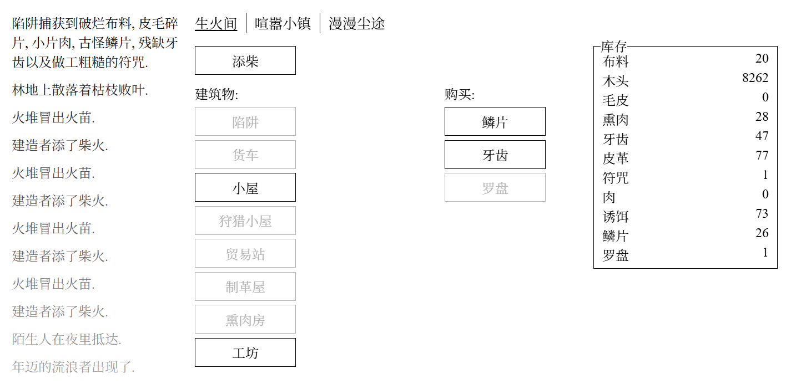

A Dark Room 暗室
===========
> "awake. head throbbing. vision blurry. come light the fire."  
> “醒来。头痛欲裂。视线模糊。去点燃那堆火。”

a minimalist text adventure game for your browser  
一个运行在浏览器中的极简文本冒险游戏

[Click to play 点击开始游戏](http://adarkroom.doublespeakgames.com)

<table>
<tr><th colspan=4>Available Languages 支持的语言选项</tr>
<tr>
	<td><a href="http://adarkroom.doublespeakgames.com/?lang=zh_cn">Chinese (Simplified) 简体</a></td>
	<td><a href="http://adarkroom.doublespeakgames.com/?lang=zh_tw">Chinese (Traditional) 繁体</a></td>
	<td><a href="http://adarkroom.doublespeakgames.com/?lang=en">English 英文</a></td>
	<td><a href="http://adarkroom.doublespeakgames.com/?lang=fr">French 法语</a></td>
</tr><tr>
	<td><a href="http://adarkroom.doublespeakgames.com/?lang=de">German 德语</a></td>
	<td><a href="http://adarkroom.doublespeakgames.com/?lang=el">Greek 希腊语</a></td>
	<td><a href="http://adarkroom.doublespeakgames.com/?lang=id">Indonesian 印尼语</a></td>
	<td><a href="http://adarkroom.doublespeakgames.com/?lang=it">Italian 意大利语</a></td>
</tr><tr>
	<td><a href="http://adarkroom.doublespeakgames.com/?lang=ja">Japanese 日语</a></td>
	<td><a href="http://adarkroom.doublespeakgames.com/?lang=ko">Korean 韩语</a></td>
	<td><a href="http://adarkroom.doublespeakgames.com/?lang=nb">Norwegian 挪威语</a></td>
	<td><a href="http://adarkroom.doublespeakgames.com/?lang=pl">Polish 波兰语</a></td>
</tr><tr>
	<td><a href="http://adarkroom.doublespeakgames.com/?lang=pt">Portuguese 葡萄牙语</a></td>
	<td><a href="http://adarkroom.doublespeakgames.com/?lang=pt_br">Portuguese (Brazil) 巴西葡萄牙语</a></td>
	<td><a href="http://adarkroom.doublespeakgames.com/?lang=ru">Russian 俄语</a></td>
	<td><a href="http://adarkroom.doublespeakgames.com/?lang=es">Spanish 西班牙语</a></td>
</tr><tr>
	<td><a href="http://adarkroom.doublespeakgames.com/?lang=sv">Swedish 瑞典语</a></td>
	<td><a href="http://adarkroom.doublespeakgames.com/?lang=th">Thai 泰语</a></td>
	<td><a href="http://adarkroom.doublespeakgames.com/?lang=tr">Turkish 土耳其语</a></td>
	<td><a href="http://adarkroom.doublespeakgames.com/?lang=uk">Ukrainian 乌克兰语</a></td>
</tr><tr>
	<td><a href="http://adarkroom.doublespeakgames.com/?lang=vi">Vietnamese 越南语</a></td>
	<td><a href="http://adarkroom.doublespeakgames.com/?lang=lt_LT">Lithuanian 立陶宛语</a></td>
	<td><a href="http://adarkroom.doublespeakgames.com/?lang=gl">Galician 加利西亚语</a></td>
</tr>
</table>


or play the latest on [GitHub](http://doublespeakgames.github.io/adarkroom)  
或在 [GitHub](http://doublespeakgames.github.io/adarkroom) 上玩最新的版本

<a href="https://itunes.apple.com/us/app/a-dark-room/id736683061"></a>
<a href="https://play.google.com/store/apps/details?id=com.yourcompany.adarkroom"></a>
<a href="https://store.steampowered.com/app/2460660/A_Dark_Room/"></a>


## 部署说明

首先感谢原作者的开源。[原项目地址](https://github.com/doublespeakgames/adarkroom)

具体汉化了那些内容，原项目支持中文，只对没有覆盖到的地方做了翻译，请参考[翻译说明](./翻译说明.md)。


有需要帮忙部署这个项目的朋友,一杯奶茶,即可程远程帮你部署，需要可联系。  
微信号 `E-0_0-`  
闲鱼搜索用户 `明月人间`  
或者邮箱 `firfe163@163.com`  
如果这个项目有帮到你。欢迎start。

有其他的项目的汉化需求，欢迎提issue。或其他方式联系通知。

### 镜像

从阿里云或华为云镜像仓库拉取镜像，注意填写镜像标签，镜像仓库中没有`latest`标签

容器内部端口 3000

```bash
swr.cn-north-4.myhuaweicloud.com/firfe/adarkroom:2025.05.10
```

### docker run 命令部署

```bash
docker run -d \
--name adarkroom \
--network bridge \
--restart always \
--log-opt max-size=1m \
--log-opt max-file=3 \
-p 3000:3000 \
swr.cn-north-4.myhuaweicloud.com/firfe/adarkroom:2025.05.10
```
### compose 文件部署 👍推荐

```yaml
#version: '3.9'
services:
  adarkroom:
    container_name: adarkroom
    image: swr.cn-north-4.myhuaweicloud.com/firfe/adarkroom:2025.05.10
    network_mode: bridge
    restart: always
    logging:
      options:
        max-size: 1m
        max-file: '3'
    ports:
      - 3000:3000
```

## 修改说明

这里对除了汉化之外的代码修改的说明。  
增加修改部分具体见 [修改说明](./修改说明.md)。

`./README.md` 文件翻译，增加 `## 部署说明`、`## 修改说明`、`## 效果截图` 部分。

增加目录 `./图片` `./remote_files`(引用的远程文件)
新增文件 `./.dockerignore`、`./Dockerfile`、`./翻译说明.md`、`./修改说明.md`

## 效果截图


